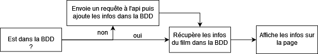
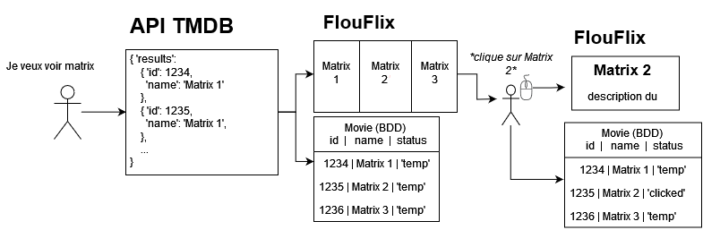

# 
 Documentation 

 

</img>

 

## Présentation

FlouFlix est un site internet présentant un catalogue complet de Film et séries où l'on peut avoir une seule WatchList regroupant toutes les plateformes VOD.

 

## Changelog

- **V5** &nbsp;&nbsp; *Mise en place de la WatchList*

  * Algorithme de recherche amélioré : sort la catégorie la plus populaire en 1er
  * Bouton pour ajouter/supprimer dans la WatchList fonctionnel
  * WatchList fonctionnelle

 

- **V4** &nbsp;&nbsp; *Pages et bouton 'Lecture' qui fonctionnent*

  * Ajout d'un barre de recherche
  * Ajout d'un champ status dans la BDD pour accélérer le site (voir [Conception](#conception)</a>) 
  * Bouton 'Lecture' fonctionnel sur les films et les épisodes (lit la 1ere vidéo youtube trouvée)
  * Page saison/ : Menu déroulant pour choisir la saison et ses épisodes

 

- **V3** &nbsp;&nbsp; *Intégration dans la BDD*

  * Ajout de 3 models (= Relation de BDD) : Movie, Serie, WatchList
  * Modification des classes Movie et Serie qui gèrent différemment si présent dans la BDD ou non
  * Page d'accueil affiche tous les films et séries déjà consultés

 

- **V2** &nbsp;&nbsp; *Ajout des pages principales*

  * Page de présentation de la technologie utilisée (/presentation/)
  * Pages browse/  ,   browse/popular/  et  browse/latest/
  * Ajout d'un header inclus dans toutes les pages
  * Un peu de css pour le style

 

- **V1** &nbsp;&nbsp; *Ajout d'une page affichant toutes les informations sur une saison et ses épisodes*

  * Création des classes : Serie, Season et Episode
  * L'application django 'movie' devient l'application plus générale 'browse', qui ne contiendra pas que les films
  * Ajout de la page browse/serie/$id$ qui récupère les informations sur une série (dont l'id est précisé dans l'url) et les affiches
  * Ajout de la page browse/serie/$id$/S$num$ qui récupère les informations sur une saison (dont le numéro et l'id sont précisé dans l'url) et les affiches ainsi que la listes de tous les épisodes
  * Ajout d'un favicon (+ gestion du dossier 'static')

 

- **V0** &nbsp;&nbsp; *Initialisation + ajout d'une page qui affiche les informations sur un film*

  * Initialisation du projet django
  * Création de l'application django intitulée 'movie'
  * Création de la classe Movie
  * Ajout de la page movie/$id$ qui récupère les informations sur un film (dont l'id est précisé dans l'url) et les affiches

 

<h2 id="conception">Conception</h2>

Le site est géré avec Django.
 

Les informations sur un film sont récupérées dans l'API TMDB.

 

Gestion de la BDD : 

A chaque fois qu'un film/série est récupéré dans l'API, il est ajouté dans la BDD avec un statut temporaire ('temp') pour qu'il soit chargé plus rapidement la prochaine fois en évitant d'envoyer une nouvelle requête inutile à l'API.
Si on clique sur un film/série, ce dernier passe au statut consulté ('clicked') dans la BDD.  
La page d'accueil du site affiche seulement les films/série consultés.

Fonctionnement général :

Exemple shcématisé du fonctionnement de la BDD avec la barre de recherche  :

