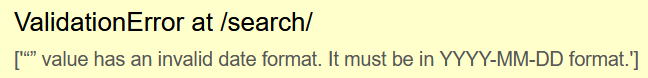
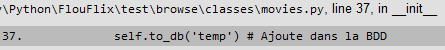
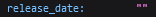

## Problème

**ValidationError**



Ce problème survenait parfois lorsque on utilisait la barre de recherche.

<br>

## Recherche de la source

L'outil de débug de Django est puissant est très précis, il m'a permis de  tout de suite cibler le problème sur un format de date invalide.

En regardant plus en détail l'erreur, on observe que l'erreur survient lors de l'ajout d'un film dans la BDD : 

J'ai alors vérifier la base de données, le champ date était bien de type *Date* est donc n'accepte que des entrées de la forme YYYY-MM-DD, ce que l'erreur nous disais déjà.

L'erreur doit donc venir du format de la date rentrée. <br>
En effet, en examinant la requête api directement dans le navigateur, on observer qu'un des films correspondant à la recherche n'est pas renseigné de sa date de sortie : .

L'erreur vient donc de là.

<br>

## Résolution

On se rend dans le fichier *movies.py*, là où la date est ajoutée dans la BDD avec cette ligne : 
```py
self._date = response['release_date']
```
Cependant, si cette reponse n'a pas un format de date alors l'erreur arrivera. 

On ajoute donc une condition dans le cas où la date serait vide pour empêcher cette erreur :
```py
if response['release_date'] != "":
            self._date = response['release_date']
        else:
            self._date = "1234-12-12"
```
On assigne donc une date bidon au cas où la vraie ne serait pas renseignée. (La date devait rester valide, donc je n'ai pas mit 0000-00-00)

<br>

#### Problème résolu !