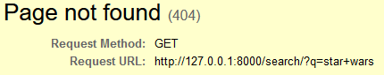
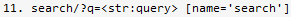

## Problème

**PageNotFound**



Ce problème survenait dès qu'on utilisait la barre de recherche.
Pourtant, une url correspondait : 

<br>

## Recherche de la source

L'url était censé être définie dans le fichier *urls.py* d'après cette ligne :
```py
path('search/?q=<str:query>', views.search, name="search"),
```
Le ?q= présent dans l'url était généré par la barre de recherche qui agit comme un formulaire grâce à la méthode GET et pass la recherche dans l'url.

En réalité ce n'étais pas vraiment un problème juste un manque de connaissances du framework car il existe avec Django une manière toute simple de gérer la méthode GET, il suffisait de lire la documentation pour la trouver.

<br>

## Résolution

Django reconnaisant un format qui semble être de la méthode GET ne prends alors pas en compte le *?* et ce qui suit, il fallait donc commencer par retifier cette ligne :
```py
path('search/', views.search, name="search"),
```
Ensuite, plus qu'à suivre la documentation et utiliser la gestion de la méthode GET fournie par Django.
La ligne ci dessus appelant la fonction *search* dans le fichiers **views.py**, c'est dans celui-ci que cela se gère :
```py
def search(request):
    try:
        query = request.GET['q'] 
    except MultiValueDictKeyError:
        query = None
```
Sans oublier de vérifier le cas où la requête serait nulle qui causerait une erreur.

<br>

#### Problème résolu !